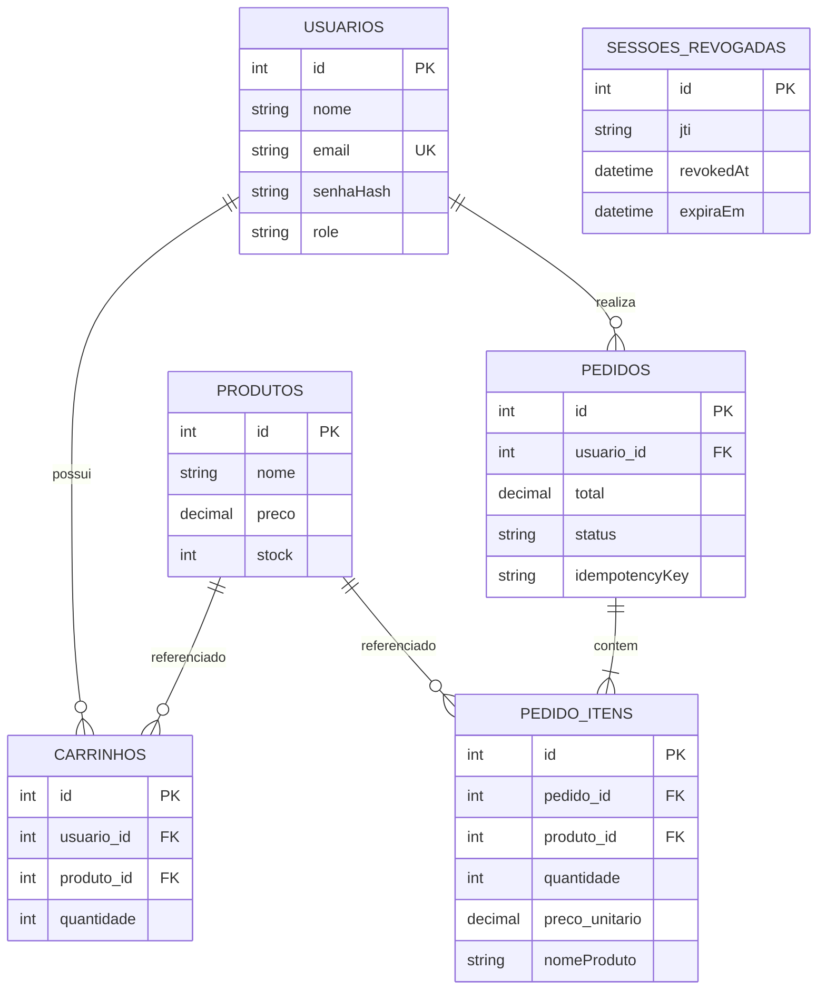

# Documentação Técnica: TechStore

## 1. Identificação do Projeto

| Campo                             | Descrição                                                                                             |
| --------------------------------- | ----------------------------------------------------------------------------------------------------- |
| **Projeto**                       | TechStore                                                                                             |
| **Tipo**                          | MVP DevOps                                                                                            |
| **Versão do MVP**                 | 1.0.0 — entrega final                                                                                 |
| **Área**                          | Persistência e Gestão de Dados                                                                        |
| **Integrantes**                   | Lays Gomes, Fellype Augusto, Ivan Teotônio, Victor Kazu                                               |
| **Objetivo**                      | Demonstrar persistência, resiliência, consistência transacional e automação de operação em containers |

### Sobre o documento

Este documento apresenta a documentação técnica do MVP **TechStore**, descrevendo a problemática recebida, a análise realizada, a solução proposta, sua arquitetura, as tecnologias utilizadas, o processo de desenvolvimento, as práticas DevOps aplicadas, os procedimentos de execução, os testes realizados, os resultados obtidos, as limitações identificadas e as possíveis evoluções futuras.

O objetivo é permitir que outra pessoa compreenda o funcionamento da solução e consiga reproduzir sua execução em um ambiente local.

---

## Sumário

1. [Identificação do Projeto](#1-identificação-do-projeto)
2. [Problemática Recebida](#2-problemática-recebida)
3. [Análise do Problema](#3-análise-do-problema)
4. [Proposta da Solução](#4-proposta-da-solução)
5. [Arquitetura da Solução](#5-arquitetura-da-solução)
6. [Componentes da Solução](#6-componentes-da-solução)
7. [Persistência e Inicialização](#7-persistência-e-inicialização)
8. [Modelo de Dados](#8-modelo-de-dados)
9. [Tecnologias e Ferramentas](#9-tecnologias-e-ferramentas)
10. [Justificativa das Escolhas Técnicas](#10-justificativa-das-escolhas-técnicas)
11. [Processo de Desenvolvimento](#11-processo-de-desenvolvimento)
12. [Práticas DevOps](#12-práticas-devops)
13. [Execução do Projeto](#13-execução-do-projeto)
14. [Testes e Validações](#14-testes-e-validações)
15. [Resultados Obtidos](#15-resultados-obtidos)
16. [Limitações da Solução](#16-limitações-da-solução)
17. [Evoluções Futuras](#17-evoluções-futuras)
18. [Conclusão](#18-conclusão)

---

## 2. Problemática Recebida

O desafio do projeto consiste em desenvolver uma aplicação cujos dados não sejam perdidos quando os containers responsáveis pela aplicação forem interrompidos, destruídos ou recriados.

Além da persistência, a solução deve garantir a integridade das informações e das operações relacionadas aos usuários, produtos, carrinhos, estoques e pedidos.

A solução deveria atender aos seguintes requisitos:

* manter usuários, produtos, carrinhos e pedidos em um banco de dados relacional;
* permitir reconstruir o ambiente local utilizando um único comando;
* evitar duplicação de dados durante a inicialização;
* preservar o catálogo e as regras de negócio;
* manter carrinho, estoque e pedido consistentes;
* comprovar a persistência dos dados após a recriação da stack.

---

## 3. Análise do Problema

A análise do problema foi dividida em quatro pontos principais: persistência, inicialização, integridade e duplicidade.

### 3.1 Persistência

Os dados da aplicação precisam permanecer disponíveis mesmo quando os containers são removidos.

Para atender a esse requisito, foi utilizado o **PostgreSQL** como banco de dados relacional, associado a um **volume Docker** responsável por armazenar os arquivos do banco independentemente do ciclo de vida dos containers.

### 3.2 Inicialização

A aplicação possui diferentes serviços que precisam ser inicializados em uma ordem adequada.

O PostgreSQL deve estar disponível antes que o backend tente realizar consultas. Para isso, foram utilizados **healthchecks** e `depends_on` no Docker Compose.

Durante a inicialização, o ambiente executa as migrações e o seed antes de disponibilizar a API.

### 3.3 Integridade dos dados

As operações relacionadas ao carrinho, estoque e pedido precisam permanecer consistentes.

A criação de um pedido é realizada dentro de uma **transação**, garantindo que as operações sejam confirmadas conjuntamente ou revertidas em caso de falha.

### 3.4 Duplicidade de operações

Uma requisição pode ser repetida devido a uma falha de rede ou a um mecanismo de retry.

Para evitar que uma mesma operação gere pedidos duplicados ou desconte o estoque novamente, foi implementado o mecanismo de **idempotência utilizando `Idempotency-Key`**.

---

## 4. Proposta da Solução

A solução desenvolvida consiste em uma aplicação web composta por três serviços principais, coordenados pelo Docker Compose:

1. **Frontend**, desenvolvido com React e Vite e servido pelo Nginx;
2. **Backend**, desenvolvido com Node.js e Express, utilizando Prisma para acesso ao banco;
3. **PostgreSQL**, responsável pela persistência dos dados.

Além desses componentes, a solução possui mecanismos destinados a aumentar a confiabilidade da aplicação, como:

* migrações versionadas;
* seed idempotente;
* autenticação JWT;
* cookies `HttpOnly`;
* revogação de sessões;
* transações;
* idempotência de pedidos;
* scripts de backup e restauração;
* validação de persistência;
* testes automatizados;
* CI e smoke tests.

---

## 5. Arquitetura da Solução

A aplicação utiliza uma arquitetura baseada em containers Docker, com os serviços conectados por uma rede interna.
```text
┌────────────────────────────────────────────────────────────────────┐
│                       REDE DOCKER (bridge)                        │
│                                                                   │
│  ┌──────────────┐       ┌──────────────┐       ┌──────────────┐   │
│  │   Frontend   │  /api │    Backend   │ Prisma│  PostgreSQL  │   │
│  │  React + Vite│──────▶│  Node.js +  │──────▶│      15      │   │
│  │  Nginx :8080 │       │   Express    │       │    :5432     │   │
│  │  Host :3001  │       │  Host :3002  │       └──────┬───────┘   │
│  └──────────────┘       └──────────────┘              │           │
│                                                     ┌────▼─────┐  │
│                                                     │ pg_data  │  │
│                                                     │  volume  │  │
│                                                     └──────────┘  │
└────────────────────────────────────────────────────────────────────┘
             ▲
             │ http://localhost:3001
        Navegador no host
```

O navegador acessa o frontend por meio da porta `3001`. O Nginx encaminha as requisições que utilizam o prefixo `/api/` para o backend.

O backend acessa o PostgreSQL através da rede interna do Docker.

### 5.1 Portas

| Serviço         | Porta interna | Porta no host | Função            |
| --------------- | ------------: | ------------: | ----------------- |
| Frontend/Nginx  |          8080 |          3001 | Interface e proxy |
| Backend/Express |          3000 |          3002 | API REST          |
| PostgreSQL      |          5432 |          5434 | Persistência      |

A porta `5434` é publicada apenas para acesso local e diagnóstico.

---

## 6. Componentes da Solução

### 6.1 Frontend

O frontend foi desenvolvido utilizando **React e Vite**.

O Dockerfile utiliza um build em múltiplas etapas, disponibilizando os arquivos gerados através do Nginx.

O Nginx possui duas responsabilidades principais:

* disponibilizar a aplicação React;
* encaminhar as requisições `/api/` para o backend.

Dessa forma, o navegador utiliza uma origem única para acessar a aplicação.

A interface também utiliza media queries e breakpoints para adaptar a navbar, a vitrine, o carrinho, o checkout, os formulários e o painel administrativo a telas menores. Em larguras móveis, a navegação principal é substituída por um menu acessível por botão.

### 6.2 Backend

O backend foi desenvolvido utilizando **Node.js e Express**, com Prisma como ORM.

A aplicação está organizada em camadas:

* **Routes:** definição dos endpoints;
* **Middlewares:** autenticação, cookies, roles, CORS, rate limit e segurança;
* **Controllers:** tratamento das requisições e respostas;
* **Services:** regras de negócio;
* **Repositories:** operações relacionadas ao Prisma;
* **Prisma:** acesso ao PostgreSQL.

A autenticação utiliza JWT armazenado no cookie `sessionToken`.

### 6.3 Banco de Dados

O **PostgreSQL 15** é utilizado como armazenamento principal da aplicação.

Seus dados são armazenados no volume Docker `pg_data`, permitindo que continuem disponíveis após a recriação dos containers.

---

## 7. Persistência e Inicialização

A inicialização da aplicação segue a seguinte sequência:

<div align="center">

```text
PostgreSQL
    ↓
Healthcheck
    ↓
Banco disponível
    ↓
Prisma Client
    ↓
Migrações
    ↓
Seed
    ↓
Backend
    ↓
Frontend
```

</div>

O banco executa o `pg_isready` para verificar sua disponibilidade.

Após o banco estar saudável:

1. o backend gera o Prisma Client;
2. as migrações são executadas;
3. o seed verifica os registros necessários;
4. o Express é iniciado;
5. o frontend fica disponível.

O seed é **idempotente**, portanto não sobrescreve dados previamente cadastrados.

---

## 8. Modelo de Dados

O modelo de dados está definido em `backend/prisma/schema.prisma`.

### DER conceitual simplificado

O diagrama abaixo representa as entidades, os atributos principais e os relacionamentos implementados no modelo de dados.



O diagrama apresenta os relacionamentos funcionais principais. As regras de unicidade, quantidades, valores e preservação dos snapshots são detalhadas nas seções seguintes.

### Tabelas do modelo

| Tabela              | Responsabilidade                                                   |
| ------------------- | ------------------------------------------------------------------ |
| `usuarios`          | Armazena usuários, roles e informações relacionadas à autenticação |
| `produtos`          | Armazena catálogo, preço, categoria, imagem e estoque              |
| `carrinhos`         | Relaciona usuários, produtos e quantidades                         |
| `pedidos`           | Armazena pedidos, valores, status, entrega e pagamento             |
| `pedido_itens`      | Armazena produtos, quantidades e preços dos pedidos                |
| `sessoes_revogadas` | Armazena sessões ou tokens invalidados                             |

### Principais relacionamentos

* Um usuário pode possuir carrinhos e pedidos;
* um carrinho pertence a um usuário e a um produto;
* um pedido pertence a um usuário;
* um pedido possui vários itens;
* cada item mantém o nome e o preço do produto no momento da compra.

### Regras de integridade

O banco possui regras para garantir:

* e-mail único;
* usuário/produto único no carrinho;
* quantidades positivas;
* preços e estoques não negativos;
* chave de idempotência única por usuário;
* preservação do preço e nome do produto no momento da compra.

---

## 9. Tecnologias e Ferramentas

| Camada             | Tecnologias                                                                                                      |
| ------------------ | ---------------------------------------------------------------------------------------------------------------- |
| **Frontend**       | React 19, Vite, React Router, Nginx, Vitest, Testing Library, Biome                                              |
| **Backend**        | Node.js 20, Express 5, Prisma 6, PostgreSQL, bcrypt, jsonwebtoken, Helmet, CORS, express-rate-limit, Jest, Biome |
| **Infraestrutura** | Docker, Docker Compose, volumes Docker, Git, GitHub Actions, Yarn, Shell, `pg_dump`, `pg_restore`                |

---

## 10. Justificativa das Escolhas Técnicas

### PostgreSQL

O PostgreSQL foi escolhido por oferecer suporte a transações, relacionamentos, constraints e índices, características importantes para as operações de carrinho, estoque e pedidos.

### Prisma

O Prisma foi utilizado para centralizar o schema do banco e facilitar o acesso aos dados através de uma camada ORM.

### Docker Compose

O Docker Compose permite definir os serviços da aplicação em conjunto e reproduzir o ambiente utilizando um único arquivo de configuração.

### Volume Docker

O volume permite separar o ciclo de vida dos dados do ciclo de vida dos containers, garantindo a persistência das informações.

### Transações

As transações são utilizadas para garantir que operações relacionadas à criação do pedido, atualização do estoque e alteração do carrinho sejam executadas de maneira consistente.

### Idempotência

O uso de `Idempotency-Key` permite identificar operações repetidas e evitar a criação duplicada de pedidos.

### Testes automatizados

Jest, Vitest e smoke tests foram utilizados para tornar a validação da aplicação reproduzível.

---

## 11. Processo de Desenvolvimento

O desenvolvimento foi dividido em três etapas principais.

### 11.1 Estabilização

Nesta etapa foram implementados e configurados:

* PostgreSQL;
* volume persistente;
* healthchecks;
* seed;
* sessões;
* catálogo;
* CORS;
* proxy;
* rate limit.

### 11.2 Consistência transacional

Nesta etapa foram implementados:

* transação do checkout;
* controle de concorrência;
* controle de estoque;
* restrição de usuário/produto no carrinho;
* idempotência;
* snapshots;
* migrações.

### 11.3 Confiabilidade operacional

A última etapa foi direcionada à validação e operação da aplicação:

* backup;
* restauração;
* readiness;
* smoke tests;
* teste de persistência;
* validação da integridade dos dados.

O desenvolvimento foi realizado utilizando branches separadas, revisão por Pull Request e merge na branch `develop`.

---

## 12. Práticas DevOps

Durante o desenvolvimento foram aplicadas as seguintes práticas:

* configuração da infraestrutura como código;
* utilização de Docker e Docker Compose;
* rede Docker dedicada;
* volume persistente;
* healthcheck do PostgreSQL;
* readiness da API;
* migrações automatizadas;
* seed idempotente;
* integração contínua;
* smoke tests;
* backup e restauração;
* gerenciamento de secrets fora do Git;
* scripts operacionais.

### Scripts

```text
scripts/
├── backup.sh
├── restore.sh
├── verify-backup.sh
└── verify-persistence.sh
```

Esses scripts permitem automatizar tarefas relacionadas à operação e validação da aplicação.

---

## 13. Execução do Projeto

### 13.1 Pré-requisitos

Para executar o projeto, é necessário possuir:

* Git;
* Docker;
* Docker Compose v2;
* portas `3001`, `3002` e `5434` disponíveis.

### 13.2 Clonando o projeto

```bash
git clone https://github.com/laas26/techstore-db-mvp.git
cd techstore-db-mvp
```

### 13.3 Inicializando a aplicação

```bash
docker compose up -d --build
```

### 13.4 Verificando os containers

```bash
docker compose ps
```

### 13.5 Verificando a API

```bash
curl http://localhost:3002/health/ready
```

O resultado esperado é:

```json
{
  "status": "ready",
  "database": "up"
}
```

### 13.6 Acessos

| Serviço   | Endereço                             |
| --------- | ------------------------------------ |
| Frontend  | `http://localhost:3001`              |
| API       | `http://localhost:3002`              |
| Health    | `http://localhost:3002/health`       |
| Readiness | `http://localhost:3002/health/ready` |

### 13.7 Usuários de demonstração

| Perfil  | E-mail                    | Senha         |
| ------- | ------------------------- | ------------- |
| Admin   | `admin@techstore.local`   | `Admin@123`   |
| Cliente | `cliente@techstore.local` | `Cliente@123` |

As credenciais apresentadas são destinadas exclusivamente à demonstração do MVP.

### 13.8 Comandos operacionais

Visualizar logs:

```bash
docker compose logs -f backend
```

Parar a aplicação:

```bash
docker compose down
```

Iniciar novamente:

```bash
docker compose up -d
```

Executar backup:

```bash
sh scripts/backup.sh
```

Verificar backup:

```bash
sh scripts/verify-backup.sh
```

Verificar persistência:

```bash
sh scripts/verify-persistence.sh
```

Para restauração:

```bash
CONFIRM_RESTORE=YES sh scripts/restore.sh backups/NOME_DO_BACKUP.dump
```

> **Atenção:** `docker compose down -v` remove também o volume e, consequentemente, os dados persistidos. Esse comando deve ser utilizado somente quando a intenção for realizar um reset completo do ambiente.

---

## 14. Testes e Validações

### 14.1 Testes do Backend

Para executar os testes:

```bash
cd backend
yarn test --runInBand
```

A suíte contempla cenários relacionados a:

* autenticação;
* seed;
* sessões;
* carrinho;
* rollback;
* concorrência;
* oversell;
* idempotência;
* readiness;
* snapshots.

**Resultado:** 9 suítes e 32 testes passando.

### 14.2 Testes do Frontend

```bash
cd frontend
yarn vitest run
yarn build
```

**Resultado:** 3 arquivos e 4 testes passando, com build concluído.

A implementação responsiva foi incluída no build de produção. A validação visual em um dispositivo real deve ser realizada antes da demonstração pública.

### 14.3 Validações de infraestrutura

Também foram executadas validações utilizando:

```bash
docker compose config

docker compose exec backend npx prisma validate
docker compose exec backend npx prisma migrate status

sh -n scripts/backup.sh
sh -n scripts/restore.sh
sh -n scripts/verify-backup.sh
sh -n scripts/verify-persistence.sh

git diff --check
```

### 14.4 Smoke Test

O smoke test verifica:

1. disponibilidade do frontend;
2. readiness da API;
3. disponibilidade do PostgreSQL;
4. existência dos produtos do seed;
5. realização do backup;
6. restauração em banco temporário;
7. persistência dos dados após `down/up`.

---

## 15. Resultados Obtidos

Os testes e validações realizados demonstraram que o MVP apresenta os seguintes comportamentos:

* persistência dos dados no PostgreSQL;
* sobrevivência dos dados armazenados no volume Docker;
* inicialização automatizada da aplicação;
* seed sem duplicação;
* autenticação com revogação de sessões persistida;
* checkout transacional;
* prevenção de oversell nos testes;
* rollback de operações;
* idempotência de pedidos;
* snapshot de produtos;
* readiness do banco;
* backup e restauração;
* verificação automatizada da persistência;
* integração contínua;
* smoke test da stack;
* layout responsivo implementado para telas pequenas, com menu móvel e adaptação dos fluxos principais.

A aplicação pode ser iniciada utilizando:

```bash
docker compose up -d --build
```

A persistência é validada através do script `scripts/verify-persistence.sh`, que verifica se os dados continuam disponíveis após a interrupção e recriação da stack sem remoção do volume.

---

## 16. Limitações da Solução

Por se tratar de um MVP, algumas funcionalidades e características ainda não estão implementadas.

As principais limitações identificadas são:

* o pagamento é simulado;
* o estoque é debitado na criação do pedido e não possui reserva expirável;
* o Docker Compose está direcionado ao ambiente de desenvolvimento;
* as credenciais padrão são destinadas somente à demonstração;
* não existe backup externo com retenção;
* não existe recuperação point-in-time;
* não existe ambiente de staging ou produção;
* algumas telas relacionadas a pedidos, usuários e administração ainda estão incompletas;
* não existe observabilidade avançada;
* a validação de lint na CI ainda não é bloqueante.

As telas administrativas ainda não implementadas, a simulação de pagamento e as evoluções futuras estão fora do escopo desta versão. Elas permanecem documentadas apenas como possibilidades de evolução.

Essas limitações estão relacionadas ao escopo do MVP e devem ser consideradas antes de uma utilização em ambiente real.

---

## 17. Evoluções Futuras

Como possíveis evoluções da solução, foram identificadas as seguintes melhorias:

### 17.1 Reserva e expiração de estoque

Implementar reserva temporária de produtos durante o checkout, liberando o estoque quando o pagamento não for concluído.

### 17.2 Histórico de pedidos e pagamentos

Registrar eventos relacionados a tentativas, cancelamentos, estornos, alterações de status e pagamentos.

### 17.3 Ledger de estoque

Criar uma trilha de movimentações de estoque, registrando entradas, saídas, vendas, ajustes, cancelamentos e reposições.

### 17.4 Backup avançado

Adicionar mecanismos de retenção, criptografia, ambientes separados e recuperação point-in-time.

### 17.5 Migrações mais seguras

Adicionar verificações prévias, detecção de dados incompatíveis, deduplicação e testes das migrações.

### 17.6 Performance e auditoria

Implementar paginação, índices adicionais, filtros, soft delete e trilha de auditoria.

### 17.7 Evolução do catálogo

Adicionar recursos como SKU e padronização das categorias, mantendo a consistência entre administração, vitrine e banco.

### 17.8 Avaliação de armazenamento não relacional

Avaliar o uso complementar de bancos de dados não relacionais para aplicações específicas, como cache, busca, auditoria, histórico de eventos ou recomendações. O PostgreSQL permanece como banco transacional principal, responsável pela consistência de usuários, carrinhos, estoque e pedidos.

---

## 18. Conclusão

O desenvolvimento do MVP TechStore permitiu implementar uma aplicação web com foco em **persistência, consistência e confiabilidade dos dados**.

A utilização do PostgreSQL em conjunto com volumes Docker possibilitou separar o armazenamento dos dados do ciclo de vida dos containers. Além disso, mecanismos como transações, idempotência, migrações, seed, autenticação, backup e restauração contribuíram para aumentar a confiabilidade da aplicação.

Os testes realizados demonstraram o funcionamento dos principais componentes do sistema, incluindo a persistência dos dados após a recriação da stack, os testes automatizados do backend e frontend e os smoke tests da infraestrutura.

Apesar das limitações existentes, principalmente por se tratar de um MVP, a solução atende aos requisitos definidos para o projeto e fornece uma base para futuras evoluções relacionadas à segurança, observabilidade, desempenho, pagamentos, estoque e operação em ambientes de produção.
